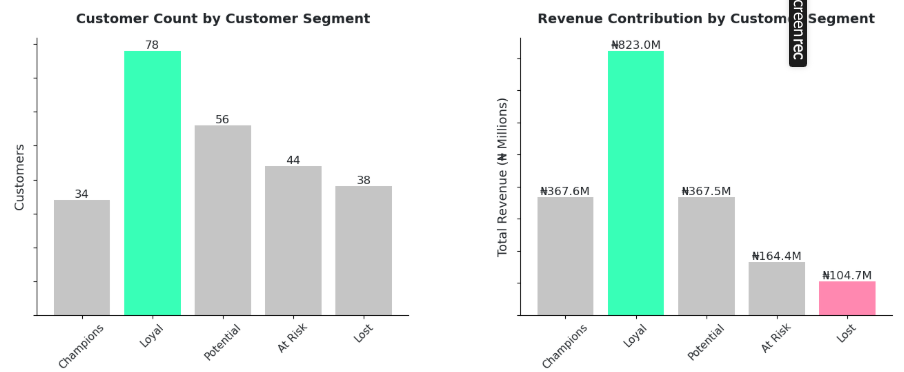
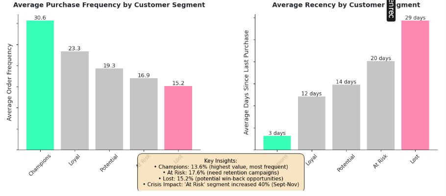

  

<!-- Title -->
<h1 align="center">Retail Performance Report</h1>

<!-- Sub-Title -->
<h2 align="center">CLIENT BACKGROUND</h2>

**Modest Apparel** is a thriving fashion and apparel retail business based in Ikeja, Lagos, Nigeria, specializing in **African-inspired fashion, traditional wear, cosmetics, and accessories**. Established in 2019, the company operates through both physical store locations and an online e-commerce platform, catering to Nigeria's growing middle class and fashion-conscious consumers across multiple states.

Like many retailers globally, Modest Apparel experienced sales boom in its first 4 years, built a loyal customer base of repeat buyers, including notable fashion influencers and boutique owners who recognized the quality and authenticity of their African fashion offerings. However, new challenges began to arise; **revenue started to decline as product prices increase due to economic crisis**, and the business stood at critical crossroads as **sustainable growth requires operational excellence and customer intelligence**.

Reporting to the CEO, this analysis was conducted to discover why revenue declined and also transform Modest Apparel into a retail operation capable of anticipating customer needs, optimizing delivery times, rewarding loyalty, and scaling efficiently. This review provides insights into the business operational efficiency, diving into these **key metrics**:

 

* **Revenue**: Focus on sales revenue, number of orders, and average order value (AOV).

* **Order Cycle Time**: Measure to improve fulfillment speed from order placement to customer delivery (target: 24 hours delivery time for customers in Lagos, 3 days for customers in Oyo and Ogun, and 5 days for customers in other locations).
  
* **Dead Stock**: Flag products with no movement in 30+ days to trigger markdown strategies or supplier returns.
  
* **Product Segmentation**: Classify products by revenue contribution to focus marketing and inventory investment on high-value items.
  
* **RFM (Recency, Frequency, Monetary)**: Identify and reward "Champion" customers, create targeted retention campaigns for customers that are at risk, and implement tiered loyalty programs with personalized benefits.

 

 

<!-- Title -->
<h1 align="center">EXECUTIVE SUMMARY</h1>

<h3 align="center">Revenue Crisis Deepens as December Hits ₦187.5M Despite Holiday Season</h3>
  

  

 

<h3 align="center">THE STRONG START (May-June 2024)</h3>

* **The healthy baseline**: The business started well, **achieving ₦509.5M over the two-month period (₦246.7M in May and ₦262.8M in June), and representing 6.5% month-over-month growth**.

 

 

<h3 align="center">THE DECLINE (July-December 2024)</h3>

* **July-August early decline**: Revenue began declining in July, **falling 8.3% to ₦241.1M from June's ₦262.8M**. It was the first revenue contraction signal, with **₦21.7M** in lost monthly revenue.

 

* **Q3 misleading strength**: Q3 achieved **₦738.7M in total revenue across July-September**, and on the surface, this appeared to signal business recovery and growth acceleration. However, this quarterly strength created false optimism as Order volume declined and **Revenue came from elevated AOV, not order growth**..

 

* **Q4 crisis (Economic Crisis Period)**:  Q4 revenue crashed to **₦587.5M, a 20.5% Q-o-Q decline**. This collapse occurred during October-December, traditionally the strongest retail quarter known for its holiday shopping seasons due to the economic crisis (characterized by fuel scarcity, foreign exchange volatility, and inflation).

 

 

<h3 align="center">WHY DID REVENUE COLLAPSE?</h3>

<h3 align="center">Orders Peaked at 805 in June Before Dropping 42% to 469 by Year End</h3>
  

  

* **Primary Cause: Order Volume Collapse**
  
Order volume decline is the dominant driver of revenue deterioration. The business lost **588 orders from Q3 (2,135 orders) to Q4 (1,547 orders), a 27.5% quarter-over-quarter collapse**.
At Q3's average AOV of **₦345.9K**, these **588** lost orders represent approximately **₦203M** in foregone revenue. Even with Q4's elevated **₦379.8K** AOV, the reduced order base could only generate **₦587.5M** versus Q3's **₦738.7M**.

 

Revenue Impact Calculation:

> * Lost orders: 588 orders × ₦345.9K (Q3 AOV) = -₦203.4M negative impact
> * AOV increase offset: 1,547 orders (Q4) × ₦33.9K gain = +₦52.4M positive offset
> * Net revenue change: -₦203.4M + ₦52.4M = -₦151.0M

 

What Contributed to Order Volume Collapse?:

* **Delivery performance failures**: 0% SLA success outside Lagos driving customer churn
* **Economic crisis conditions**: Reduced consumer spending power in October-November period
* **Lost customer migration**: At Risk and Lost segments (82 customers) went from ₦269M historical revenue to minimal current engagement
* **Inefficient Product Mix and Dead Stock**: The business maintains **90 SKUs, with 47 products (52% of portfolio) generating only 5.2%** of revenue. One product (Black Sleeveless Jumpsuit) has **47 units in dead stock with 6% sell-through rate**. This inefficiency ties up capital.

<!-- <h3 align="center">THE STRONG START (May-June 2024)</h3>

The business started well, **generating ₦509.5M in revenue from 1,580 orders over two months**. June represented **peak performance with 805 orders**, demonstrating robust customer acquisition and healthy engagement levels. Customer purchasing patterns remained stable and predictable, with Average Order Value (AOV) **holding steady at ₦320-327K throughout this period**.

 

 

<h3 align="center">THE DECLINE (July-December 2024)</h3>

Initial decline signals appeared in July when orders **decreased 6.8% to 750 units**. By August, order volume had fallen further to **720**. September revenue **reached ₦288.1M**, creating an appearance of recovery. However, this masked critical underlying issues:

 

- Order volume continued **declining to 665 (from June's 805)**
- The revenue increase came from elevated AOV **(₦433K)**, not increased orders (this means fewer customers were making larger purchases)

 

 

<h3 align="center">THE CRISIS PERIOD (September-November)</h3>

The final quarter revealed the severity of business challenges:

In October, revenue declined **30% month-over-month to ₦201.6M** as economic crisis conditions intensified. In November, performance remained low **at ₦198.4M with 496 orders** (the lowest monthly order count) and in December, despite traditional holiday season strength, revenue fell to **₦187.5M with only 469 orders**.

 

 

 

<h3 align="center">THE ROOT CAUSE</h3>

<h3 align="center">Revenue Crisis Deepens as December Hits ₦187.5M Despite Holiday Season</h3>

  

**1. Primary Issue: Order Volume Collapse**

 

Order count declined **27.5% quarter-over-quarter from Q3 to Q4 (2,135 orders to 1,547 orders)**. This represents the dominant driver of revenue decline. While AOV increased **9.8%** to partially offset losses, the reduction in customer transactions proved overwhelming. The loss of **588 quarterly orders** equates to approximately **₦200M** in foregone revenue.

 

**2. Operational Issue: Delivery Performance Failure**

Service Level Agreement (SLA) compliance rates reveal critical logistics problems:

 

- Lagos region: **18-24%** on-time delivery (below acceptable standards)
- Ogun/Oyo regions: **0%** on-time delivery (complete failure)
- Other locations: **0%** on-time delivery (complete failure)

 

**3. Portfolio Issue: Inefficient Product Mix and Dead Stock**

The business maintains **90 SKUs, with 47 products (52% of portfolio) generating only 5.2%** of revenue. One product (Black Sleeveless Jumpsuit) has **47 units in dead stock with 6% sell-through rate**. This inefficiency ties up capital, increases complexity, and dilutes management focus from high-performing products.  -->

 

 

 

<h3 align="center">RECOMMENDATIONS</h3>

* Conduct emergency performance reviews with all carrier partners and begin evaluation of alternative carrier options for regional markets if they are unwilling to make changes.
* Implement flash sale for Black Sleeveless Jumpsuit to recover approximately ₦700K in tied-up capital
* Launch tiered discount program: 10% after 5th purchase, 15% after 10th purchase
* Create bundle offers: Traditional + Other product categories at reasonable discounts

 

 

 

<h1 align="center">DATA STRUCTURE AND ERD (ENTITY RELATIONSHIP DIAGRAM)</h1>

The Modest Apparel database structure comprises seven interconnected tables containing 75,564 total records from eight months of operations (May-December 2024). At its core, the Order_Details table (42,077 records) serves as the central fact table, linking to dimension tables including Customers (251 records), Products (89 items across 4 categories), and Suppliers (22 vendors). 

Supporting operational tables track Shipping_Details (26,137 records) for logistics performance, Labor (6,276 records) for warehouse productivity, and Inventory (712 records) for stock management.

 

  

 

 

 

<h2 align="center">INSIGHTS DEEP-DIVE</h2>

<h3 align="center">ORDERS ANALYSIS</h3>

* **ORDER VOLUME COLLAPSE**

Order volume represents the most direct indicator of market demand and customer engagement. The 41.7% collapse from June's peak of 805 orders to 469 orders in December shows the severity of the situation at hand.

 
  
* **UNIT SALES PERFORMANCE BY CATEGORY**

<h3 align="center">Unit Sales Collapsed Across All Categories from June Peak Through December</h3>

  

**The order volume decline manifested as reduced unit sales across every product category**, reinforcing that this is a market-wide demand crisis rather than category-specific challenges. Traditional category units collapsed from 13,469 in June to 7,917 by December (41.2% decline). Modern units fell from 2,001 to 1,124 (43.8% decline). Cosmetics dropped from 940 to 574 (38.9% decline). Accessories decreased from 647 to 402 (37.9% decline).

 

* **ORDER FREQUENCY ACROSS CATEGORIES**

<h3 align="center">Traditional Products Included in Over 9 Out of 10 Customer Orders</h3>

  

Traditional products appeared in **4,824 orders out of 5,257 total orders (91.7% inclusion rate)**. Modern products appeared in 3,405 orders (64.7%), Cosmetics in 2,365 orders (44.9%), and Accessories in 1,878 orders (35.7%). These penetration rates demonstrate **Traditional's role as the core purchase driver while other categories serve as complementary add-ons**.

 

<!--
* **REPEAT PURCHASE BEHAVIOUR**

Traditional category generated 19.30 orders per customer on average, significantly exceeding Modern (13.62 orders), Cosmetics (9.46 orders), and Accessories (7.54 orders). 
-->

 

 

<h3 align="center">AVERAGE ORDER VALUE (AOV)</h3>

<h3 align="center">Despite Declined Orders, Average Order Value Increased During and After Economic Crisis Period</h3>

  

* **AOV PERFORMANCE**

There is an inverse relationship between orders and Average Order Value during the economic crisis period. While Orders declined 14.3% from September to October, AOV remained elevated at ₦346.4K compared to pre-crisis baselines of ₦318-₦326K. This shows that fewer customers placed orders, but those who continued purchasing maintained or increased their basket sizes which could be due to the following reasons:

First, **customers may have consolidated shopping trips** to reduce transaction costs (delivery fees, time investment). Second, **anticipatory buying may have driven larger basket sizes as customers stocked up expecting further price increases** or supply disruptions.

 

*AOV vs ORDER VOLUME TRADE-OFF*

> AOV increases cannot compensate for order volume decline. September achieved ₦288.1M revenue with 665 orders at ₦433.4K AOV. If Modest Apparel had maintained June's 805 orders at September's elevated AOV, revenue would have reached ₦348.9M (21.1% higher than achieved). Conversely, December's 469 orders at even the elevated ₦400.0K AOV would generate only ₦187.6M. This mathematics demonstrates that order volume acquisition is more critical than AOV optimization for revenue recovery.

 

 

<h3 align="center">ORDER CYCLE TIME PERFORMANCE</h3>

<h3 align="center">Cycle Time Performance Unstable with Four Months Averaging Above 100 Hours and November Peaking at 104.0h</h3>

  

* **OVERALL CYCLE TIME PERFORMANCE**

Order cycle time reveals severe operational inefficiencies that likely contributed to customer dissatisfaction and churn. The target performance varies by location: **Lagos (2 days/48 hours), Ogun/Oyo (3 days/72 hours), and Other Locations (5 days/120 hours)**. However, the business consistently failed to meet these targets across all regions throughout the analysis period. 

The November peak in cycle time (104.0h) coinciding with the steepest order volume decline (M-o-M) suggests a direct correlation between operational performance and customer retention. Poor delivery performance likely contributed significantly to the 336 order decline from June to December.

* **CARRIER PERFORMANCE ANALYSIS BY GEOGRAPHIC REGION**

<h3 align="center">All Carriers Failed to Meet Delivery Time Targets to Other Locations Except Lagos, Minimally Succeeding</h3>

  

**Carrier-specific performance reveals systemic 3PL (third-party logistics) provider failures across most delivery zones**. Lagos, the primary market, achieved only minimal success rates: DiD Logistics met SLA on 24.1% of orders, Green Star Express on 18.6%, and KwiiQi Delivery on 18.0%. **For Ogun/Oyo and Other Locations, all three carriers achieved 0% SLA success rate**, a complete operational failure that undoubtedly damages customer satisfaction and retention.

 

 

<h3 align="center">DEAD STOCK</h3>

Dead stock analysis identified one critical inventory management failure: **the Black Sleeveless Jumpsuit**. From an initial supply of 50 units, only 3 units sold over the 8-month analysis period, indicating a 6% sell-through rate. The remaining 47 units have been stagnant in the warehouse for over 60 days since the last sale, tying up capital and warehouse space that could be allocated to better-performing SKUs.

 

 

<h3 align="center">ABC PRODUCT SEGMENTATION</h3>

<h3 align="center">22% of Top Performing Products Contributed 80% to Revenue and 52% of the Bottom Performing Products Contributed Just 5.2% to Revenue</h3>

  

* **CLASS A PRODUCT ANALYSIS (THE REVENUE DRIVERS)**

The 20 Class A products represent the business core and must be protected at all costs. Each Class A product generated an average of ₦75.0M in revenue over the 8-month period (₦9.4M per month average). Critically, all 20 Class A products belong to the Traditional category, reinforcing the complete dependency on Traditional wear for business viability. These products should receive priority in inventory management, marketing investment, quality control, and supplier relationships.

 

*REPEAT PURCHASE BEHAVIOR*

<h3 align="center">Traditional Category Products Dominated Repeat Purchases at 19.30 Orders While Other Categories Trailed Below 14</h3>

  

Traditional products generated 19.30 orders per customer, 41.7% higher than Modern (13.62 orders), 104.0% higher than Cosmetics (9.46 orders), and 156.0% higher than Accessories (7.54 orders). This gap suggests that Traditional product category drives, single transactions, ongoing customer relationships and repeat business.

 

* **CLASS B PRODUCTS (THE MIDDLE PERFORMERS)**

Class B products (23 SKUs) generated ₦288M total revenue, averaging ₦12.5M per SKU over 8 months. These products represent opportunities for potential promotion to Class A status through targeted marketing, pricing optimization, or bundling strategies.

 

* **CLASS C PRODUCTS**

Class C products represent 52.2% of SKU count but generated merely 5.2% of revenue. These 47 products average only ₦2.1M revenue per SKU over 8 months (₦260K monthly). Class C includes the dead stock item (Black Sleeveless Jumpsuit) and most Cosmetics and Accessories SKUs.

 

 

 

<h3 align="center">RFM CUSTOMER SEGMENTATION</h3>

<h3 align="center">RFM Customer Segmentation Analysis (May-Dec 2024)</h3>

  

  

The segmentation reveals that while the Loyal segment represents the largest customer base, Champions demonstrate the most valuable purchasing behaviors that should be replicated across other segments.

 

* **PURCHASE FREQUENCY TREND**

<h3 align="center">Purchase Frequency Deteriorated Across Every Customer Segment During 8-Month Period</h3>

  

No customer segment was immune; Champions, Loyal, Potential, At Risk, and Lost all experienced declining purchase rates from May through December 2024.

 

* **PURCHASE FREQUENCY TREND**

<h3 align="center">Champions Segment Alone Shows Higher Monetary Value At Year End Compared to Start While Other Segments Declined Sharply</h3>

  

Monetary value trends reveal Champions as the only segment maintaining and growing spending throughout the economic crisis period. Champions increased from ₦31.1M in August to ₦158M in September, still showing net positive trajectory. In stark contrast, all other segments experienced sustained monetary value decline: Loyal fell from ₦147.8M (May) to ₦55.8M (Dec), Potential from ₦56.7M to ₦9.0M, At Risk from ₦29.6M to ₦2.6M, and Lost from ₦12.5M in May to ₦2.7M September.

 

 

<!-- Title -->
<h1 align="center">RECOMMENDATIONS</h1>

* **Revenue Crisis Requiring Immediate Intervention**:
December revenue of ₦187.5M represents a 24.0% decline from May baseline and 35.2% collapse from September peak. The business is losing approximately ₦59M monthly compared to peak performance, with no sign of recovery. 

> 1.	Implement aggressive customer reactivation campaign targeting Lost and At Risk segments (82 customers, ₦269M historical revenue potential)e
> 2.	Develop partnerships or bulk purchasing agreements with Champions segment profile customers (boutique owners, resellers)

 

* **Order Volume Collapse as Primary Revenue Driver**:  One thing is clear; recovering 200 of the lost orders at current AOV (₦340K) would generate ₦68M monthly revenue increase (a 36.3% boost over December performance). Order volume acquisition must be the absolute strategic priority over AOV optimization or product mix improvements.

> 1.	Create loyalty rewards program offering 10-15% discounts after 5th purchase to incentivize repeat orders
> 2.	Implement referral program and develop targeted marketing campaigns for Potential segment (56 customers) to increase order frequency from 19.3 to 23.3 (Loyal benchmark)

 

* **Operational Performance Crisis Damaging Customer Satisfaction**:
All carriers achieve 0% SLA success rate for Ogun/Oyo and Other Locations, with only 18-24% success in Lagos.

> 1.	Conduct urgent 3PL carrier performance review with potential contract termination for persistent underperformers
> 2.	Evaluate alternative carrier options specifically for Ogun/Oyo and Other Locations where current 0% success rate

 
 
* **Customer Segment Deterioration Accelerating Business Decline**:
Purchase frequency declined across all five RFM segments from May through December, with some segments experiencing 60-70% reduction in ordering rate.

> 1.	Develop Champions retention program: VIP treatment, early access to new products, exclusive discounts to protect this critical 19-customer segment
> 2.	Create Potential-to-Loyal conversion program: email nurture sequence, personalized product recommendations, time-limited promotions
> 3.	Launch At Risk intervention campaign: direct outreach via phone/WhatsApp, special comeback offers at 20-25% discount
> 4.	Implement Lost segment win-back: aggressive 30-40% discount offers, free delivery, no-risk return policy to recover 25-30% of churned customers

 

* **Inventory Management Inefficiency and Dead Stock**:
Black Sleeveless Jumpsuit (47 dead stock units) represents ₦613K in tied-up capital.

> 1.	Immediately liquidate Black Sleeveless Jumpsuit dead stock through flash sale or donate for tax write-off
> 2.	Focus 95% of inventory investment on 20 Class A Traditional products to prevent stockouts of revenue drivers

 

 

<h1 align="center">TECHNICAL DETAILS</h1>

This project used Python for all stages of data analysis and visualization with a focus on exploring revenue and orders, and describing Modest Apparel's operational inefficiencies between May 2024 and December 2024.

1. Skills & Functions Used
Libraries: Numpy, Pandas, Matplotlib, datetime
Skills: Groupby, Merge, Datatype Conversion, Subplots

2. Steps Overview:

- Data Cleaning: Checked all source tables (Order Details, Customer, Product, Supplier, Inventory, Labor, Shipping Details) for missing values, duplicate entries, inconsistent data types, and ambiguous category names. However, they are clean data.

- Import necessary Libraries

- Load All Data

- Initail Table Inspection: Using .info to converting data types of columns needed to be converted

- Data Analysis & Visualization: Using Groupby, Merge to calculate metrics (revenue, units sold, aov, order cycle time (hours), RFM (recency, frequency, monetary) and Subplots for visualizations

